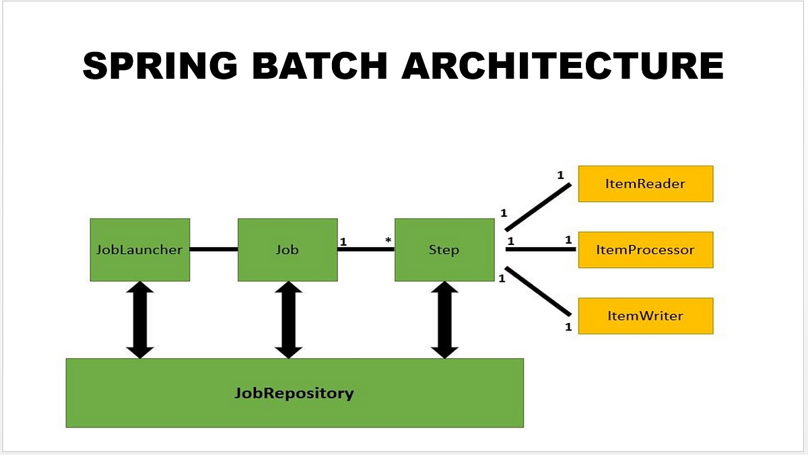
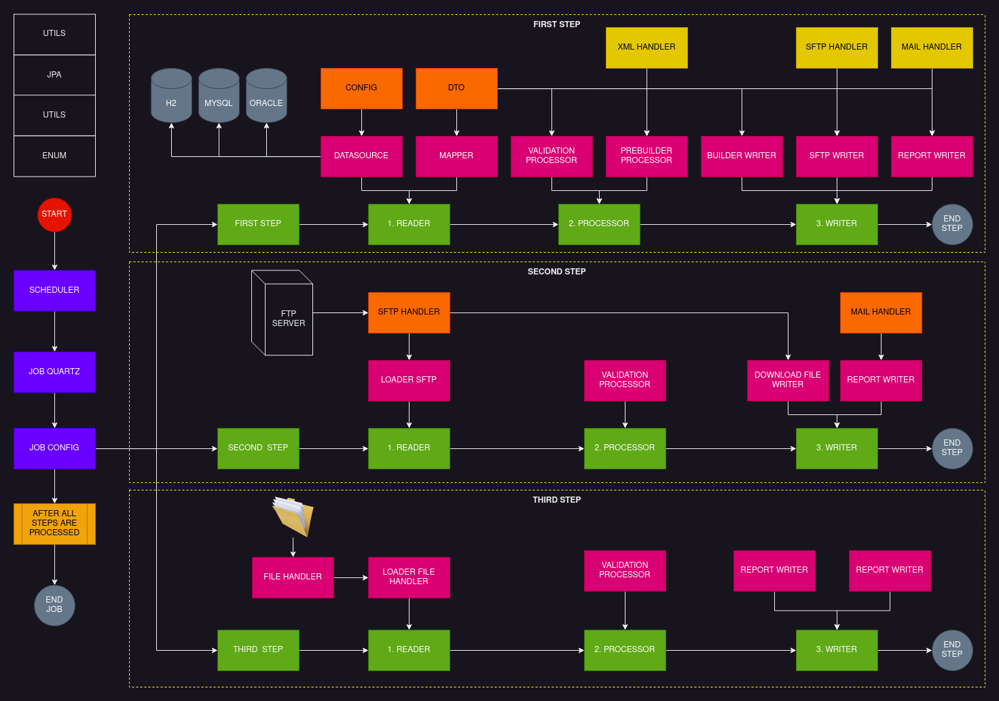

# SPRING BATCH JOB DEMO

# Idiomas

- Language: Portugues Brazil (pt-br)  |  <a href="README-EN.md">Inglês (en)</a>

# Pre Requisitos

- Java 17
- H2 Database
- Mysql Database
- Oraclelinux
- Sftp Server
- Mail Server

> Para ajudar e otimizar o uso desse projeto de demonstração você pode usar o Docker Series que também esta 
> presente nessa conta no github cujo link é https://github.com/huntercodexs/docker-series, onde existe um 
> ambiente pre configurado na branch h2_mysql_oracle_sftp_mailhog que pode ser acessado pelo link 
> https://github.com/huntercodexs/docker-series/tree/h2_mysql_oracle_sftp_mailhog, siga as instruções de uso 
> e tenha uma boa experiência

# Proposta do Projeto (do que se trata ?)

Esse é um projeto demo para demonstrar como um job funciona usando o framework java spring batch, embora exista muitos 
formatos de configurações e usos do spring batch para criação de um job, será abordado aqui a definição padrão de 
funcionamento, conforme ilustração abaixo:

A proposta vai além da demonstração de um fluxo para jobs usando spring batch, onde será mostrado também instegrações 
com recursos externos como um servidor SFTP, envio de email e leitura de arquivos para processamento em massa. Abaixo 
temos o fluxo completo do projeto, apresentando todos os steps e processamentos efetuados durante o ciclo de vida de uma 
execução do job

- Diagrama de Overview

# Apresentação do Projeto

O projeto pode ser descrito da seguinte forma: 

- O nome do JOB foi definido para enrollmentValidationJob;
- O Job foi desenvolvido para processamento de cadastros de produtos que devem ser validados, enviados para o servidor 
FTP e reportados para os responsaveis pelos produtos, como setor de vendas, estoque e compras.
- O JOB possui 3 etapas (steps) e cada etapa possui 3 tarefas, leitura (reader), processameto (processor) e gravaçao (writer);
  - ETAPA 1:
    - Na etapa 1 (FirstStep) o JOB faz a leitura da base de dados, através da task ItemReader, para extrair os dados que 
    devem ser processados, ou seja, validados e enviados para o servidor FTP
    - Logo em seguida ainda na task ItemProcessor, os dados são processados e validados para a etapa posterior
    - Na ultima task da etapa 1, ou seja na task ItemWriter, os dados são definitivamente gerados e enviados para o 
    servidor FTP, assim como também são reportados por email para os devidos responsaveis
    - Apos o envio dos arquivos com sucesso, os arquivos são marcados como .processed, por exemplo:
      - spring-batch-job-demo-data-20230608234700.txt > spring-batch-job-demo-data-20230608234700.txt.processed
    - Nessa etapa também são enviados por email os produtos que foram processados
  - ETAPA 2:
    - Na etapa 2 (SecondStep) o JOB faz a leitura dos arquivos que foram processados pelo provedor de serviços e que 
    estão disponiveis no servidor FTP na pasta download, na verdade são arquivos de resposta ou retorno que o provedor 
    gerou durante o processamento dos arquivos enviados na ETAPA 1 e que devem ser recebidos pelo JOB, processados e 
    informados aos devidos responsaveis o status desse processamento
    - Apos o download dos arquivos eles estarão na pasta pre definida no properties: por exemplo:
      - spring-batch-job-demo-data-20230608193001-20230608234702.download
  - ETAPA 3:
    - Na etapa 3 (ThirdStep) os arquivos que foram recebidos etapa anterior serão processados e finalizados conforme 
    as regras e condições previstas no sistema e serão marcados como finalizados, por exemplo:
      - spring-batch-job-demo-data-20230608193001-20230608234702.download.finished

# Como funciona

Quando o JOB é executado, ele faz o agendamento das etapas e tarefas conforme programado para executar durante a hora e 
minuto definidos no arquivo de propriedades. 

Basicamente ele efetua a leitura da base de dados em busca dos registros de produtos a serem validados e consolidados, 
envio dos produtos para servidor FTP por meio de um arquivo para então serem processados.

Logo após o processamento pelo provedor de serviços (no servidor FTP) são disponibilizados arquivos de resposta referente 
ao processamento dos arquivos, então o JOB faz a leitura e captura desses arquivos para baixar para a maquina local 
onde o JOB esta sendo executado.

Para finalizar o fluxo de processamento, o JOB executa a ultima etapa que nesse caso é o processamento dos arquivos que 
foram baixados na etapa anterior e que devem ser processados e finalizados.

Todas as etapas geram um report por email informando o status e o que esta ocorrendo durante um processamento do JOB.

# Configurações

Para usar esse projeto deve se atentar aos seguintes pontos:

- Criar a base de dados, nesse caso chamada huntercodexs: 

<pre>
CREATE DATABASE huntercodexs CHARACTER SET utf8mb4 COLLATE utf8mb4_general_ci;
</pre>

- Popular a base de dados criada:

<pre>
CREATE TABLE `PRODUCTS` (
  `id` bigint NOT NULL AUTO_INCREMENT,
  `name` varchar(255) COLLATE utf8mb4_general_ci DEFAULT NULL,
  `description` varchar(255) COLLATE utf8mb4_general_ci DEFAULT NULL,
  `price` varchar(255) COLLATE utf8mb4_general_ci DEFAULT NULL,
  PRIMARY KEY (`id`)
) ENGINE=MyISAM DEFAULT CHARSET=utf8mb4 COLLATE=utf8mb4_general_ci;

CREATE TABLE `SALES` (
  `id` bigint NOT NULL AUTO_INCREMENT,
  `product` varchar(255) COLLATE utf8mb4_general_ci DEFAULT NULL,
  `quantity` varchar(255) COLLATE utf8mb4_general_ci DEFAULT NULL,
  `total` varchar(255) COLLATE utf8mb4_general_ci DEFAULT NULL,
  PRIMARY KEY (`id`)
) ENGINE=MyISAM DEFAULT CHARSET=utf8mb4 COLLATE=utf8mb4_general_ci;

INSERT INTO PRODUCTS (id, name, description, price) VALUES (1, 'Plastic Bags', 'Plastic bags to shopping', '40,00');
INSERT INTO PRODUCTS (id, name, description, price) VALUES (2, 'Wallet Plan', 'Money Wallet', '20,00');

INSERT INTO SALES (id, product, quantity, total) VALUES (1, 'Plastic Bags', '3', '120,00');
INSERT INTO SALES (id, product, quantity, total) VALUES (2, 'Wallet Plan', '2', '80,00');

</pre>

- Configurar o acesso ao servidor SFTP:

<pre>
## SFTPD
# -------------------------------------------------------------------------------------------------------------------
sftp.server.address=192.168.0.204
sftp.server.port=35022
sftp.username=sftp-user
sftp.password=sftp-pass
sftp.allow.unknown-hosts=true
sftp.folder-upload-path=upload/
sftp.folder-download-path=download/
sftp.extension-files-download=.txt.response
sftp.localfolder-receive-path=/home/$USER/txt/download/
sftp.localfolder-finished-path=/home/$USER/txt/download/finished/
</pre>

- Configurar o agendamento do JOB:

<pre>
## JOB SETTINGS
# -------------------------------------------------------------------------------------------------------------------
job.enrollment-validation.enabled=true
job.enrollment-validation.hour=23
job.enrollment-validation.minute=47
</pre>

> Para mais detalhes verificar o arquivo application.properties

# Extras

Antes de rodar o projeto certifique-se de ter o ambiente corretamente configurado.
